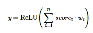

## 题目背景
期末要到了，小菜同学找到了自己的好朋友顿顿，希望可以预测一下自己这学期是否会挂科。

## 题目描述
首先，顿顿选取了如“课堂表现”、“自习时长”、“作业得分”、“社团活动参与度”等 n 项指标作为预测的依据。
然后，顿顿根据自己平日里对小菜的暗中观察，以百分制给每一项指标打分，即小菜同学第 i（1<=i<=n）项指标的得分 
score_i 是一个 [0-100] 范围内的整数。
鉴于每一项指标的重要性不尽相同，顿顿用一个 [-10,10] 范围内的整数 w_i 来表示第  i（1<=i<=n）项指标的重要程度。

最后，小菜同学期末的安全指数 y 定义如下：


其中 ReLU(x)=max(0,x)  是一种常见的激活函数。
因为使用了 ReLU 函数，安全指数一定是个非负值。
如果安全指数过低（甚至为零），则说明小菜同学这学期很可能要挂科了……

已知每一项指标的重要程度 w_i 和相应的得分 score_i ，快来算算小菜同学期末的安全指数吧。

## 输入格式
从标准输入读入数据。

输入的第一行包含一个正整数 n，保证 2<=n<=10^5。

接下来输入 n 行，其中第 i（1<=i<=n）行包含用空格分隔的两个整数 w_i 和 score_i，分别表示第 i 项指标的重要程度和小菜同学该项的得分。

## 输出格式
输出到标准输出。

输出一个非负整数 y，表示小菜同学期末的安全指数。

## 样例1输入
```data
6
2 60
10 100
0 70
0 0
-10 50
10 60
```

## 样例1输出
```
1220
```
## 样例1解释
y = ReLU(1220) = 1220

## 样例2输入
```
2
-10 100
-1 15
```

## 样例2输出
```
0
```

## 样例2解释
y = ReLU(-1015) = 0
