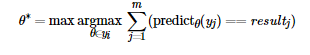

## 题目背景
考虑到安全指数是一个较大范围内的整数、小菜很可能搞不清楚自己是否真的安全，顿顿决定设置一个阈值 θ ，以便将安全指数 y 转化为一个具体的预测结果——“会挂科”或“不会挂科”。

因为安全指数越高表明小菜同学挂科的可能性越低，所以当 y>=θ 时，顿顿会预测小菜这学期很安全、不会挂科；反之若 y<θ，顿顿就会劝诫小菜：“你期末要挂科了，勿谓言之不预也。”

那么这个阈值该如何设定呢？顿顿准备从过往中寻找答案。

## 题目描述
具体来说，顿顿评估了 m 位同学上学期的安全指数，其中第 i（1<=i<=m）位同学的安全指数为 y_i，是一个 [0,10^8] 范围内的整数；同时，该同学上学期的挂科情况记作 result_i ∈0,1 
，其中 0 表示挂科、 1表示未挂科。

相应地，顿顿用 predictθ(y) 表示根据阈值 θ 将安全指数 y 转化为的具体预测结果。
如果 predictθ(y_i) 与 result_i 相同，则说明阈值为 θ 时顿顿对第 i 位同学是否挂科预测正确；不同则说明预测错误。


 

最后，顿顿设计了如下公式来计算最佳阈值 θ*：
  

  

该公式亦可等价地表述为如下规则：

1. 最佳阈值仅在 y_i 中选取，即与某位同学的安全指数相同；

2. 按照该阈值对这 m 位同学上学期的挂科情况进行预测，预测正确的次数最多（即准确率最高）；

3. 多个阈值均可以达到最高准确率时，选取其中最大的。

## 输入格式
从标准输入读入数据。

输入的第一行包含一个正整数 m。

接下来输入 m 行，其中第 i（1<=i<=m）行包括用空格分隔的两个整数 y_i 和 result_i，含义如上文所述。

## 输出格式
输出到标准输出。

输出一个整数，表示最佳阈值 θ*。

## 样例1输入
```
6
0 0
1 0
1 1
3 1
5 1
7 1
```

## 样例1输出
```
3
```

## 样例1解释
按照规则一，最佳阈值的选取范围为 0,1,3,5,7。

 θ=0 时，预测正确次数为 4；

 θ=1 时，预测正确次数为 5；

 θ=3 时，预测正确次数为 5；

 θ=5 时，预测正确次数为 4；

 θ=7 时，预测正确次数为 3。

阈值选取为 1 或 3 时，预测准确率最高；
所以按照规则二，最佳阈值的选取范围缩小为 1,3。

依规则三，θ* = max(1,3) =3。

## 样例2输入
```
8
5 1
5 0
5 0
2 1
3 0
4 0
100000000 1
1 0
```

## 样例2输出
```
100000000
```

## 子任务
70% 的测试数据保证 m<=200；

全部的测试数据保证 2<=m<=10^5。
